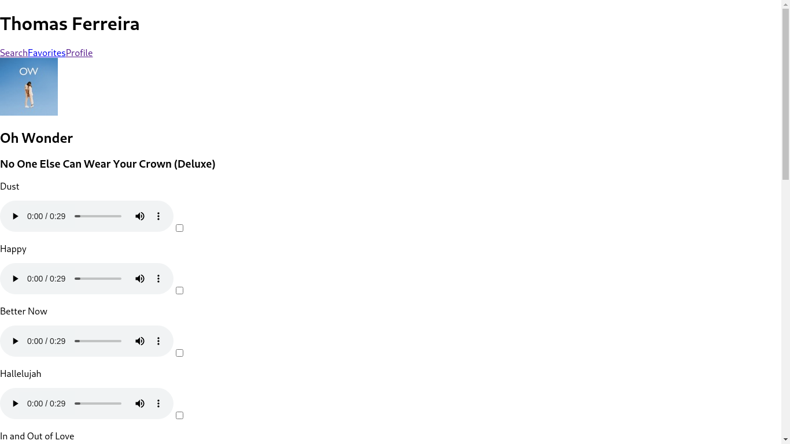

# trybe-project-trybetunes
[14/09/20] Projeto da Trybe onde foi desenvolvido uma aplicação capaz de reproduzir músicas das mais variadas bandas e artistas, criar uma lista de músicas favoritas e editar o perfil da pessoa usuária logada.

# Trybe Project Trybetunes 14/09/2021
 

  
  

 

## Habilidades

- Fazer requisições e consumir dados vindos de uma API;
- Utilizar os ciclos de vida de um componente React;
- Utilizar a função setState de forma a garantir que um determinado código só é executado após o estado ser atualizado
- Utilizar o componente BrowserRouter corretamente;
- Criar rotas, mapeando o caminho da URL com o componente correspondente, via Route;
- Utilizar o Switch do React Router
- Usar o componente Redirect pra redirecionar para uma rota específica;
- Criar links de navegação na aplicação com o componente Link.

## Desenvolvimento
Uma [aplicação](https://weltonthomasferreira.github.io/trybe-project-trybetunes/) capaz de reproduzir músicas das mais variadas bandas e artistas, criar uma lista de músicas favoritas e editar o perfil da pessoa usuária logada.

## Resultados

- `2` dia de projeto;
- `12` requisitos;
- Percentual de cumprimento de requisitos obrigatórios `90.00%`;
- Percentual de cumprimento de requisitos totais `83.33%`.

